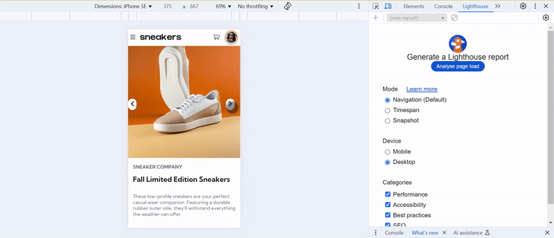

# Frontend Mentor - E-commerce product page solution

This is a solution to the [E-commerce product page challenge on Frontend Mentor](https://www.frontendmentor.io/challenges/ecommerce-product-page-UPsZ9MJp6). Frontend Mentor challenges help you improve your coding skills by building realistic projects.

## Table of contents

- [Overview](#overview)
  - [The challenge](#the-challenge)
  - [Screenshot](#screenshot)
  - [Links](#links)
- [My process](#my-process)
  - [Built with](#built-with)
  - [What I learned](#what-i-learned)
  - [Continued development](#continued-development)
  - [Useful resources](#useful-resources)
- [Author](#author)
- [Acknowledgments](#acknowledgments)

**Note: Delete this note and update the table of contents based on what sections you keep.**

## Overview

### The challenge

Users should be able to:

- View the optimal layout for the site depending on their device's screen size
- See hover states for all interactive elements on the page
- Open a lightbox gallery by clicking on the large product image
- Switch the large product image by clicking on the small thumbnail images
- Add items to the cart
- View the cart and remove items from it

### Screenshot



### Links

- Solution URL: [Github](https://github.com/snigdha-sukun/ecommerce-product-page)
- Live Site URL: [Vercel](https://ecommerce-product-page-sigma-red.vercel.app/)

## My process

### Built with

- Semantic HTML5 markup
- CSS custom properties
- Flexbox
- CSS Grid

### What I learned

I leanred how to create Lightbox:

```html
<section class="container">
      <div class="product-images">
        
      </div>
      <div class="row">
        <div class="column">
          
        </div>
        <div class="column">
          
        </div>
        <div class="column">
          
        </div>
        <div class="column">
          
        </div>
      </div>
    </section>
<section class="modal" id="myModal">
      <div class="modal-content">
        <span class="close cursor" id="close-modal">
          <svg width="14" height="15" xmlns="http://www.w3.org/2000/svg">
            <path
              d="m11.596.782 2.122 2.122L9.12 7.499l4.597 4.597-2.122 2.122L7 9.62l-4.595 4.597-2.122-2.122L4.878 7.5.282 2.904 2.404.782l4.595 4.596L11.596.782Z"
              fill="#fff" fill-rule="evenodd" />
          </svg>
        </span>

        <div class="modal-slides">
          <span class="prev" id="prev"></span>
          <div class="mySlides modal-images">
            
          </div>

          <div class="mySlides modal-images">
            
          </div>

          <div class="mySlides modal-images">
            
          </div>

          <div class="mySlides modal-images">
            
          </div>


          <span class="next" id="next"></span>
        </div>

        <div class="row">
          <div class="column">
            
          </div>
          <div class="column">
            
          </div>
          <div class="column">
            
          </div>
          <div class="column">
            
          </div>
        </div>
      </div>
    </section>
```

```css
.modal {
  display: none;
  position: fixed;
  z-index: 10;
  left: 0;
  top: 0;
  width: 100%;
  height: 100%;
  overflow: auto;
  background-color: var(--black);
}

.modal-images {
    width: fit-content;
}

.modal-content {
  position: relative;
}

.modal-slides {
    display: flex;
    justify-content: center;
    align-items: center;
}

.close {
  position: absolute;
  top: 1rem;
  right: 2rem;
  cursor: pointer;
}

.modal-img {
    width: 35%;
    border-radius: 1rem;
    margin: 1rem;
}

.prev,
.next {
  cursor: pointer;
  background-color: var(--white);
  padding: 0.5rem;
  border-radius: 2.5rem;
  width: auto;
  transition: 0.6s ease;
}

.next {
  right: 0;
}

.row {
  display: flex;
    justify-content: center;
    align-items: center;
}

.column {
  margin: 0.25rem;
  padding: 0;
}

.thumb {
    opacity: 1;
    border-radius: 0.5rem;
    cursor: pointer;
}

.active,
.thumb:hover {
    opacity: 0.6;
}

.active {
    border: 2px solid var(--orange);
}
```

```js
function openModal() {
    myModal.style.display = "block";
}

function closeModal() {
    myModal.style.display = "none";
}

let slideIndex = 1;

showSlides(slideIndex);

function plusSlides(n) {
    slideIndex += n;
}

function currentSlide(n) {
    slideIndex = n;
    showSlides(slideIndex);
}

function showSlides(n) {
    let i;
    const slides = document.getElementsByClassName("modal-images");
    const dots = document.getElementsByClassName("demo");
    if (n > slides.length) { slideIndex = 1 }
    if (n < 1) { slideIndex = slides.length }
    for (i = 0; i < slides.length; i++) {
        slides[i].style.display = "none";
    }
    for (i = 0; i < dots.length; i++) {
        dots[i].className = dots[i].className.replace(" active", "");
    }
    slides[slideIndex - 1].style.display = "block";
    dots[slideIndex - 1].className += " active";
}

demo.forEach((thumbnail, i) => {
    thumbnail.addEventListener('click', () => {
        currentSlide(i + 1);
    });
});

cursor.forEach((thumbnail, i) => {
    thumbnail.addEventListener('click', () => {
        currentSlide(i + 1);
        openModal();
    });
});

close.addEventListener('click', () => {
    closeModal();
});

prev.addEventListener('click', () => {
    plusSlides(-1);
    showSlides(slideIndex);
});

next.addEventListener('click', () => {
    plusSlides(1)
    showSlides(slideIndex);
});
```

I learned how to create a slideshow:

```html
<section class="slideshow">
      <span class="prev prev-mobile" id="prev-mobile"></span>
      <div class="slide">
        
      </div>

      <div class="slide">
        
      </div>

      <div class="slide">
        
      </div>

      <div class="slide">
        
      </div>

      <span class="next next-mobile" id="next-mobile"></span>
    </section>
```

```js
let slideIndex = 1;

showSlidesMobile(slideIndex);

function plusSlides(n) {
    slideIndex += n;
}

function showSlidesMobile(n) {
    let i;
    const slides = document.getElementsByClassName("slide");
    if (n > slides.length) { slideIndex = 1 }
    if (n < 1) { slideIndex = slides.length }
    for (i = 0; i < slides.length; i++) {
        slides[i].style.display = "none";
    }
    slides[slideIndex - 1].style.display = "block";
}

prevMobile.addEventListener('click', () => {
    plusSlides(-1)
    showSlidesMobile(slideIndex);
});

nextMobile.addEventListener('click', () => {
    plusSlides(1)
    showSlidesMobile(slideIndex);
});
```

### Continued development

I still need to practice the positioning an element & `@media`. I need to practice using JS for making the UI to react to different events. I also need to learn about responsive CSS, HTML5 rules & JS best practices. I need to learn more about `aria-*` tags for accessibilty.

### Useful resources

- [How TO - Lightbox](https://www.w3schools.com/howto/howto_js_lightbox.asp) - This helped me in creating the lightbox as required in the design.
- [How TO - Slideshow Gallery](https://www.w3schools.com/howto/howto_js_slideshow_gallery.asp) - This helped me in creating the slideshow required for the mobile design.

## Author

- Frontend Mentor - [@snigdha-sukun](https://www.frontendmentor.io/profile/snigdha-sukun)
